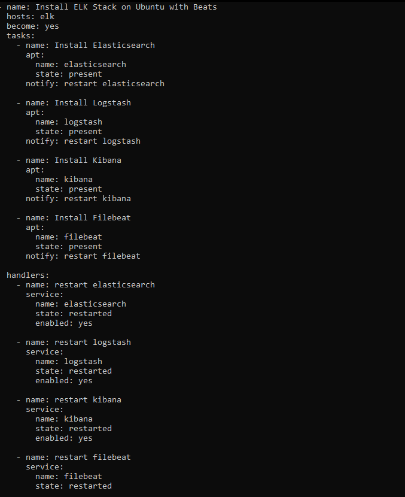
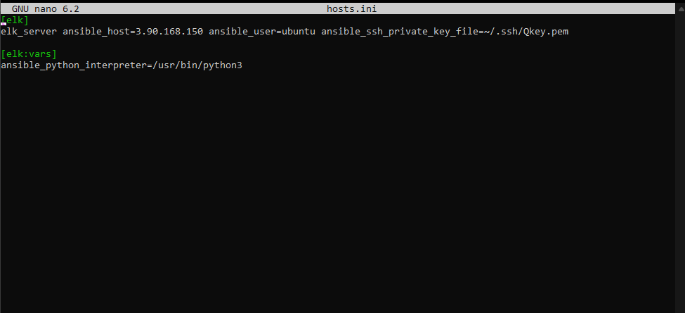
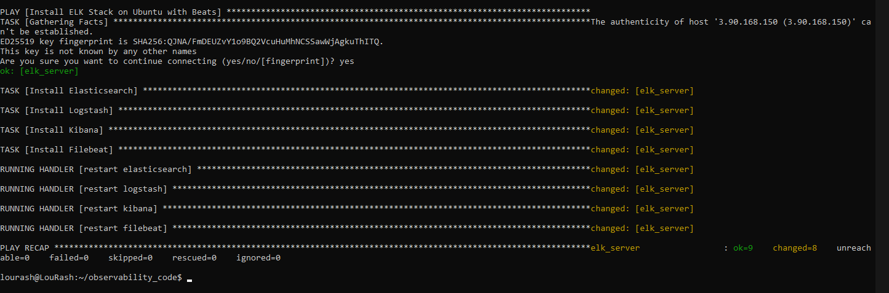

#   OBSERVABILITY-CODE

Set up ELK using Ansible.

## Setting Up WSL 2 with Ubuntu and Ansible

This guide details the steps to set up Windows Subsystem for Linux 2 (WSL 2) with Ubuntu and install Ansible for automation tasks.

**Prerequisites:**

* Windows 10 version 2004 or later (check `winver` command)
* Administrator privileges
* Virtualization enabled in BIOS (check manufacturer instructions)

# Part 1: Enabling WSL 2**

1. **Turn on WSL features:**

    - Open **Settings** > **Apps** > **Optional features**.
    - Click **"Add a feature"** and search for "Windows Subsystem for Linux."
    - Select it and click **"Install."**

2. **Enable WSL 2 kernel:**

    - Open a PowerShell window **as administrator** (right-click Start menu and select "Windows PowerShell (Admin)").
    - Run the command:

    ```powershell
    Set-DefaultFeature -Name VirtualMachinePlatform -Version latest
    ```

    - Restart your computer when prompted.

3. **Install Ubuntu distribution:**

    - Open the Microsoft Store app.
    - Search for "Ubuntu" and choose the desired version (e.g., "Ubuntu 22.04 LTS").
    - Click **"Install"** and wait for the download to complete.

# Part 2: Setting Up Ubuntu**

1. **Launch Ubuntu:**

    - Open the Start menu and search for your installed Ubuntu distribution.
    - Click on it to launch the Ubuntu terminal.

2. **Set up username and password:**

    - Follow the on-screen instructions to create a username and password for your Ubuntu environment.

3. **Update and upgrade packages:**

    - In the Ubuntu terminal, run the following commands:

    ```bash
    sudo apt update
    sudo apt upgrade -y
    ```

# Part 3: Installing Ansible**

1. **Add Ansible repository:**

    ```bash
    sudo apt add-repository ppa:ansible/ansible
    sudo apt update
    ```

2. **Install Ansible:**

    ```bash
    sudo apt install ansible -y
    ```

**Verification:**

1. **Check Ansible version:**

    ```bash
    ansible --version
    ```

This command should display the installed Ansible version.

By following these steps, you should successfully set up WSL 2 with Ubuntu and have Ansible installed for automation tasks within your Ubuntu environment. Remember to adjust commands and paths based on your specific version and needs.


# Part 4: Copying PEM Key to WSL and Configuring Passwordless SSH Login

## Copy PEM Key to WSL:

**Purpose:** We need the PEM key file within the WSL environment for SSH to recognize it.

1. Open a WSL terminal.
2. Navigate to your desired directory for the key (e.g., `cd ~`).
3. Use the `cp` command to copy the key from your Windows file system:

    ```bash
    cp /mnt/c/Path/To/Your/Key.pem ~/.ssh/
    ```
    *Replace `/mnt/c/Path/To/Your/Key.pem` with the actual path to your PEM key file on Windows.*

## Set Correct Permissions:

```bash
chmod 600 ~/.ssh/Key.pem
```

This ensures only your user can read the key for security. Replace Key.pem with the actual name of your key file.

##  Configure SSH (using ~/.ssh/config):
1.  Open the configuration file for editing:
```bash
nano ~/.ssh/config
```
2.  Add the following lines, replacing placeholders with your details:
```bash
Host YourServerName  # Replace with your server's hostname or IP
    HostName YourRemoteHost  # Replace with your server's hostname or IP
    User your_remote_username  # Replace with your username on the server
    IdentityFile ~/.ssh/Key.pem

```


3.  Save and close the file (Ctrl+X, then Y and Enter in nano).

##  Verify SSH Configuration (Optional but Recommended):
Test the passwordless login before relying on it:
```bash
ssh your_remote_username@YourRemoteHost  # Replace with your details
```


##  Add Key to ssh-agent and SSH into Server:
1.  Start the ssh-agent:
```bash
eval `ssh-agent -s`
```

2.  Add the private key to the ssh-agent:

```bash
ssh-add <path-to-private-key>
```
3.  Confirm the key has been added:
```bash
ssh-add -l
```

You should see the name of your key.

4.  Now, ssh into your server using ssh-agent:

```bash
ssh -A ubuntu@public-ip
```
Replace public-ip with your server's public IP address.

# Deploying ELK Stack with Ansible Playbook

1.  Create an Ansible Playbook:

*   Create a file named Install_elk.yml in the directory ~/observability_code..
*   Paste the following content into the file:

```bash
---
- name: Install ELK Stack on Ubuntu with Beats
  hosts: elk
  become: yes
  tasks:
    - name: Install Elasticsearch
      apt:
        name: elasticsearch
        state: present
      notify: restart elasticsearch

    - name: Install Logstash
      apt:
        name: logstash
        state: present
      notify: restart logstash

    - name: Install Kibana
      apt:
        name: kibana
        state: present
      notify: restart kibana

    - name: Install Filebeat
      apt:
        name: filebeat
        state: present
      notify: restart filebeat

handlers:
  - name: restart elasticsearch
    service:
      name: elasticsearch
      state: restarted
      enabled: yes

  - name: restart logstash
    service:
      name: logstash
      state: restarted
      enabled: yes

  - name: restart kibana
    service:
      name: kibana
      state: restarted
      enabled: yes

  - name: restart filebeat
    service:
      name: filebeat
      state: restarted
      enabled: yes

```


**Inventory File**:

*   Ensure that you have an Ansible inventory file named hosts.ini in the same directory as the playbook.
*   This file should define the host or hosts where you want to deploy the ELK Stack. In this case, it should contain a group named elk with the hostname or IP address of your target host.



2.  Run the Playbook:

Open a WSL terminal and navigate to the directory containing Install_elk.yml.

Run the following command to execute the playbook:

```bash
ansible-playbook -i hosts.ini install_elk.yml
```


#   Part 6: Configuring Kibana

1.  Edit the Kibana Configuration File:

*   Open a WSL terminal and execute the following command to edit the Kibana configuration file:

```bash
sudo nano /etc/kibana/kibana.yml
```

2.  Make the Necessary Changes:

*   Find and modify the following settings within the configuration file:

    *   Server.port: 5601 (Ensure this line is present and uncommented)
    *   server.host: "0.0.0.0" (Set to "0.0.0.0" for accessibility from outside)
    *   elasticsearch.hosts: ["http://localhost:9200"] (Ensure Elasticsearch address is correct)
    *   kibana.index: ".kibana" (Ensure this index name is set)
    *   logging.dest: stdout (Optional for logging to the console)

3.  Save and Restart Kibana:

*   Press Ctrl+X to exit the editor, pressing Y to confirm saving changes.

*   Restart Kibana for the changes to take effect:

```bash
sudo service kibana restart
```


